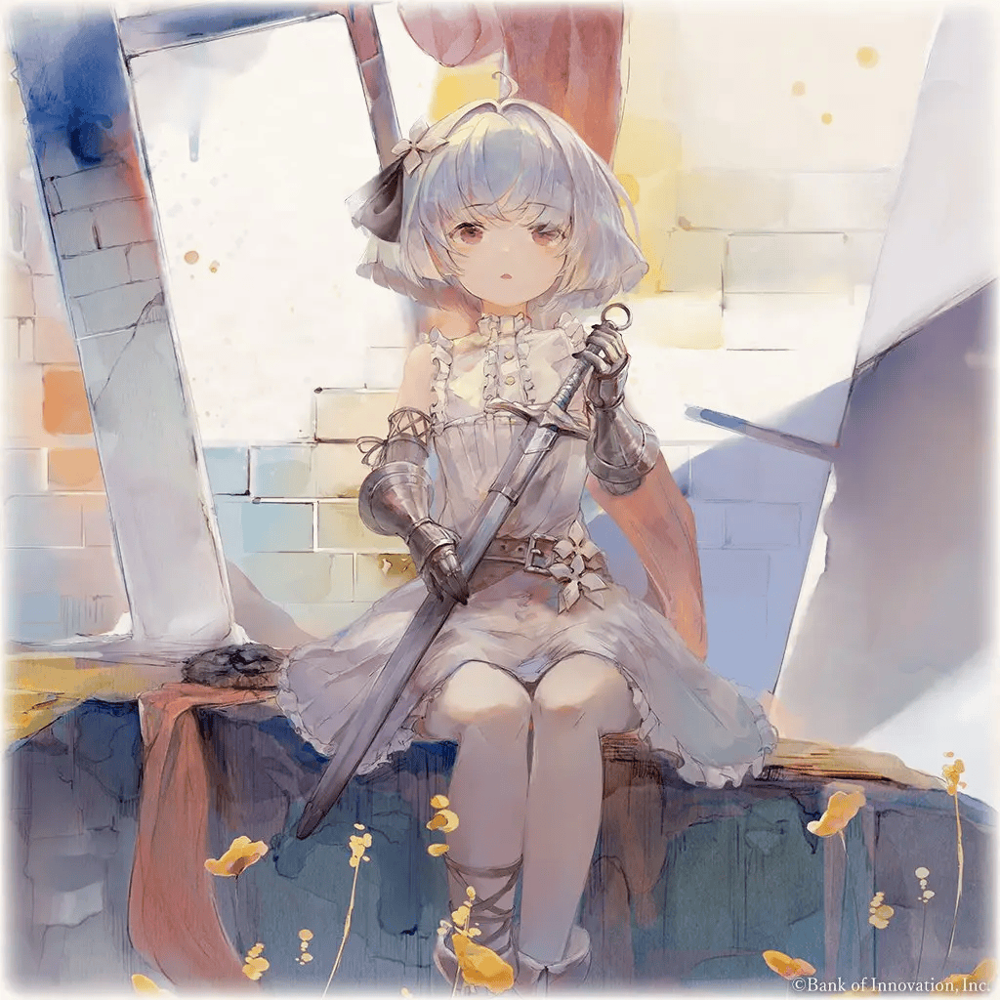

# 自我介绍 (Self-Introduction)

 <h1>About Me🎉</h1> 

      
 
---

## Welcome To My GitHub! 🧐

### My Self-Introduction 🏫

My name is **half(sum)mer ( 半夏 )**.I am a student majoring in Microelectronics Science and Engineering at **Dongguan University of Technology(东莞理工学院DGUT)**

I'm 20-year-old now(2025), and I come from Meizhou in Guangdong province of China. I am particularly interested in embedded systems and mainly study C language.  Although I may not be as proficient as some highly skilled individuals yet, I will continue to study hard with passion.

**Here is a picture of the collection 😋**

---

### My Social Account :yum:

- :tv:**BiliBili**: [半夏へ](https://space.bilibili.com/399903838)
- :penguin:**QQ**: 2949766309

### My Email :mailbox: 

- QQ Mail: 2949766309@QQ.com
